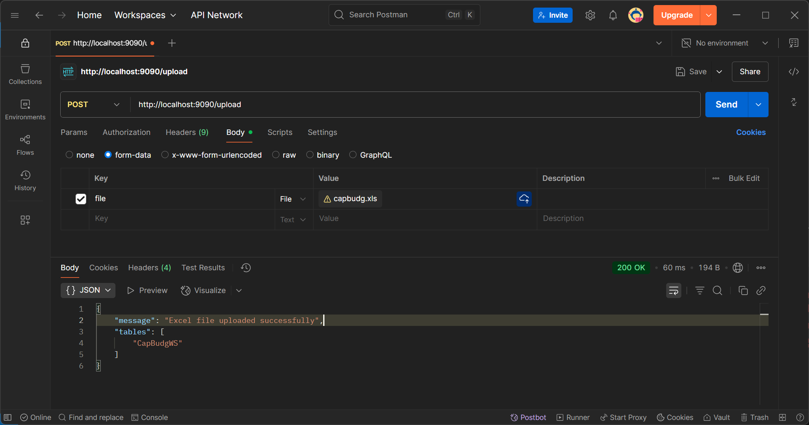
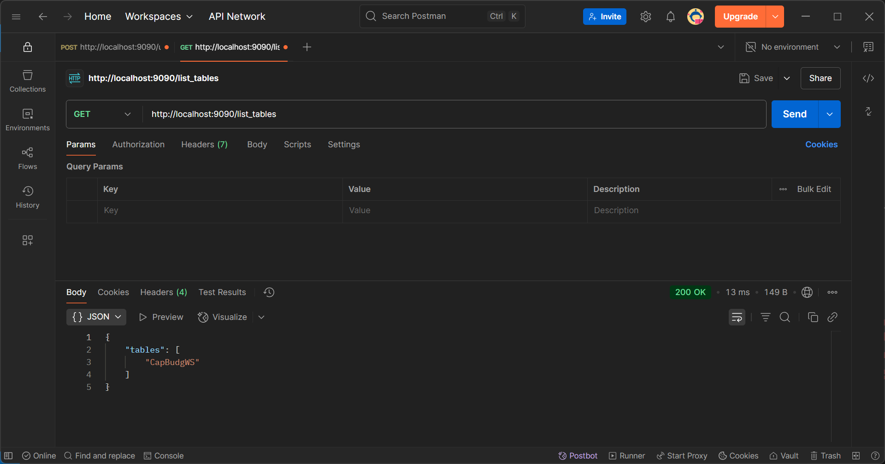
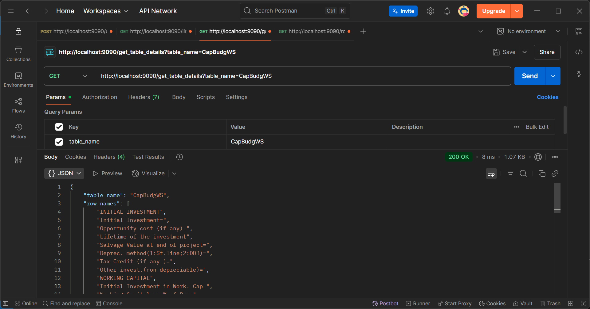
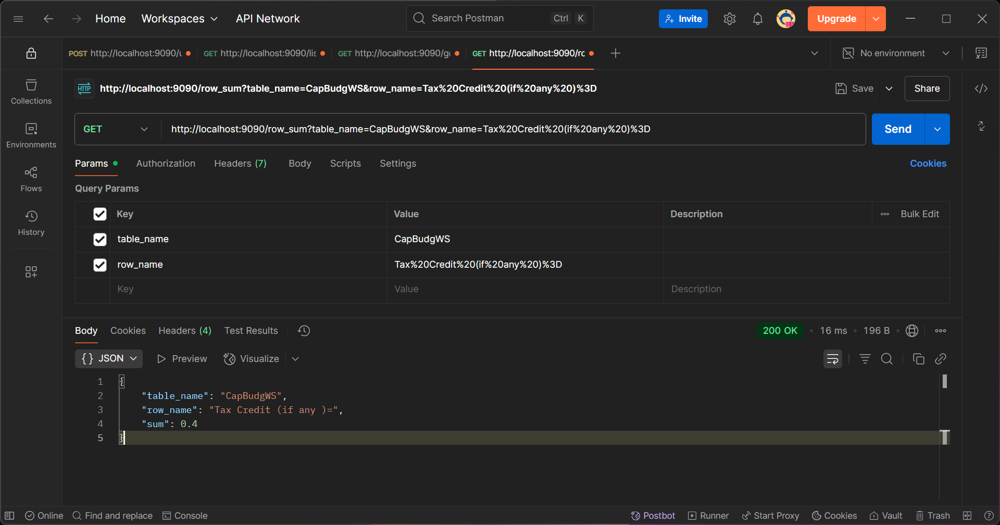

# 📊 Enhanced Excel Processor API (FastAPI)

A **FastAPI** application that dynamically reads, processes, and analyzes Excel (`.xls` and `.xlsx`) files, providing RESTful endpoints to interact with sheet tables, rows, and columns. This API handles complex Excel data formats and edge cases, ensuring reliable data extraction and numeric summarization.

---

## ✨ Features

- 📂 Upload Excel files (`.xls` or `.xlsx`) dynamically via API
- 🗞️ Detect and extract tables from any Excel sheet
- 📂 List all available sheets/tables in the uploaded file
- 🔍 Retrieve row names (first column values) for any table
- ➕ Compute sums of numeric values in:
  - Specific rows (`/row_sum`)
  - Specific columns (`/column_sum`)
- 🧠 Robust parsing of complex numeric formats:
  - Scientific notation (`1.23E+5`)
  - Currency values (`$1,000`)
  - Percentages (`10%`)
  - Mixed fractions (`1 3/4`)
- 📜 Supports pagination for large tables (`limit`, `offset`)
- ❌ Graceful handling of empty, missing, or corrupt Excel files
- 🧼 Strong input validation and error handling
- ⚙️ Optionally include hidden sheets and rows (`?include_hidden=true`)
- 🔄 Thread-safe file processing for concurrent requests
- 📡 Interactive API documentation via Swagger UI

---

## 📦 Installation

```bash
# Clone the repository
git clone <repository-url>
cd <repository-directory>

# Create and activate a virtual environment
python -m venv venv
# Linux/macOS
source venv/bin/activate
# Windows
venv\Scripts\activate

# Install dependencies
pip install -r requirements.txt
```

---

## 🚀 Running the API

```bash
uvicorn main:app --reload --port 9090
```

Open in browser: [http://127.0.0.1:9090/docs](http://127.0.0.1:9090/docs)

---

## 🔗 API Endpoints

| Endpoint             | Method | Description                                | Params                          |
| -------------------- | ------ | ------------------------------------------ | ------------------------------- |
| `/upload`            | POST   | Upload an Excel file (.xls or .xlsx)       | `file` (form-data)              |
| `/list_tables`       | GET    | List all sheet/table names                 | None                            |
| `/get_table_details` | GET    | Get row names (first column) for a sheet   | `table_name`, `limit`, `offset` |
| `/row_sum`           | GET    | Sum of numeric values in a specific row    | `table_name`, `row_name`        |
| `/column_sum`        | GET    | Sum of numeric values in a specific column | `table_name`, `column_name`     |

---

## 🧪 Testing with Postman

Use the included Postman collection: `postman_collection.json`
[Download Postman Collection](postman_collection.json)


- Base URL: `http://localhost:9090`
- Import collection, test upload, list, row/column sum

---

## ⚠️ Handling Edge Cases

- Invalid files: Graceful rejection with error message
- Empty/Non-numeric columns: Return `0` or message
- Trimmed names: Avoid mismatches
- Large files: Use `limit` and `offset`
- Concurrent requests: Thread-safe
- Complex formats: Handle currency, %, fractions, scientific notation
- Hidden data: Optional inclusion via query
- Special chars: Sanitized and URL-safe

---

## 📂 Project Structure

```
├── excel_processor.py       # Core Excel logic
├── main.py                  # FastAPI app and routes
├── requirements.txt         # Dependencies
├── postman_collection.json  # Postman collection
├── README.md                # Documentation
└── screenshots/             # Screenshot samples
```

---

## 🔮 Future Enhancements

- Chunked streaming for large files
- Caching and storage backend
- Analytics endpoints (avg, min/max)
- Frontend UI for interaction
- Automated tests for all cases

---

## 🖼️ Screenshots with Output

**Upload API Response**

```json
{
  "message": "Excel file uploaded successfully",
  "tables": ["CapBudgWS"]
}
```

**List Tables Response**

```json
{
  "tables": ["CapBudgWS"]
}
```

**Get Table Details Response**

```json
{
  "table_name": "CapBudgWS",
  "row_names": ["INITIAL INVESTMENT", "Tax Credit (if any )=", ...]
}
```

**Row Sum Response**

```json
{
  "table_name": "CapBudgWS",
  "row_name": "Tax Credit (if any )=",
  "sum": 0.4
}
```

---

